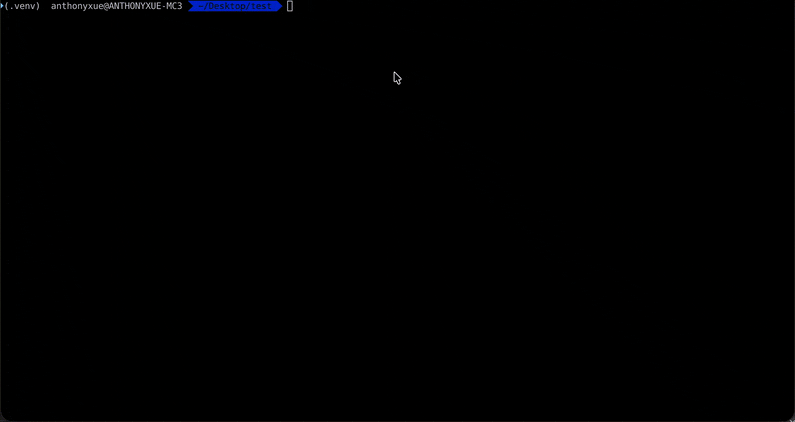

<p align="center">
  
</p>

<h1 align="center">Anthony Agent</h1>

<p align="center">
  <b>轻量、透明、可定制的终端 AI 编码助手</b><br>
  ~2000 行 Python · 会话明文存储 · 兼容任意 OpenAI API · 兼容 Claude Code Skill
</p>

<p align="center">
  
  
</p>

<p align="center">
  
</p>

---

## ✨ 为什么选 Anthony Agent

- **轻量简单** — 全部代码 ~2000 行 Python，无复杂框架，依赖少，几分钟读完核心逻辑
- **记忆透明** — 所有会话数据以 JSONL 明文存储在当前项目目录下（`.anthony/`），随时可查、可改、可删，不藏黑盒
- **模型自由** — 兼容任何 OpenAI 格式 API：OpenAI / DeepSeek / Qwen / Ollama 本地模型，一个 `.env` 切换
- **技能生态** — Skill 格式兼容 [Claude Code](https://docs.anthropic.com/en/docs/agents-and-tools/claude-code/skills) 和 [OpenClaw](https://github.com/nicepkg/openclaw)，可直接从 [ClawHub](https://clawhub.com) 下载社区技能
- **可学可改** — 配套 8 章教程，从 CLI 到 Agent 循环到上下文压缩，适合学习 Agent 架构或基于此二次开发

## 🏗️ 架构

```
CLI (cli.py)
 └─ AgentApp (Textual TUI)
     ├─ Agent (ReAct Loop)
     │   ├─ OpenAIClient (异步流式 LLM)
     │   ├─ ToolRegistry → 14 个内置工具
     │   ├─ SessionManager (JSONL 持久化)
     │   └─ Compactor (两层上下文压缩)
     └─ EventRenderer (事件 → UI 渲染)
```

## 🚀 快速开始

### 1. 安装

```bash
git clone https://github.com/your-username/anthony-agent.git
cd anthony-agent
pip install -e .
```

### 2. 配置

配置文件路径：`~/.anthony/.env`

```bash
mkdir -p ~/.anthony
cp .env.example ~/.anthony/.env
```

编辑 `~/.anthony/.env`，填入你的 API Key：

```bash
# 必填
OPENAI_API_KEY=sk-your-api-key-here

# API 地址（兼容任何 OpenAI 格式的 API）
OPENAI_BASE_URL=https://api.openai.com/v1

# 模型名称
MODEL_NAME=gpt-4o

# 是否支持图片输入（DeepSeek 等纯文本模型设为 false）
SUPPORTS_VISION=true

# Token 上限
MAX_COMPLETION_TOKENS=12800
MAX_INPUT_TOKENS=200000

# 可选：联网搜索需要 Tavily API Key
TAVILY_API_KEY=your-tavily-api-key-here
```

#### 使用其他模型

兼容所有 OpenAI 格式 API，只需修改 `BASE_URL`、`API_KEY` 和 `MODEL_NAME`：

<details>
<summary><b>DeepSeek</b></summary>

```bash
OPENAI_API_KEY=sk-your-deepseek-key
OPENAI_BASE_URL=https://api.deepseek.com/v1
MODEL_NAME=deepseek-chat
SUPPORTS_VISION=false
```
</details>

<details>
<summary><b>Qwen (通义千问)</b></summary>

```bash
OPENAI_API_KEY=sk-your-qwen-key
OPENAI_BASE_URL=https://dashscope.aliyuncs.com/compatible-mode/v1
MODEL_NAME=qwen-max
SUPPORTS_VISION=true
```
</details>

<details>
<summary><b>本地模型 (Ollama)</b></summary>

```bash
OPENAI_API_KEY=ollama
OPENAI_BASE_URL=http://localhost:11434/v1
MODEL_NAME=qwen2.5:32b
SUPPORTS_VISION=false
MAX_INPUT_TOKENS=32000
```
</details>

<details>
<summary><b>其他兼容 API（Azure OpenAI / Groq / Together AI / vLLM / LM Studio 等）</b></summary>

按上述格式配置对应的 `BASE_URL`、`API_KEY` 和 `MODEL_NAME` 即可。
</details>

### 3. 使用

```bash
anthony              # 进入会话（自动恢复最近会话或新建）
anthony --new        # 新建会话
anthony --resume     # 恢复最近会话
anthony --resume ID  # 恢复指定会话
anthony list         # 列出历史会话
anthony skills       # 列出可用技能
```

进入后直接用自然语言对话。Agent 会自主调用工具完成任务：读写文件、搜索代码、执行命令、联网查资料等。

### 会话数据

所有会话数据存储在**当前工作目录**下的 `.anthony/sessions/` 中：

```
.anthony/
└── sessions/
    └── 20260512_143022_a1b2/
        ├── messages.jsonl       # 完整对话记录
        └── transcripts/         # 上下文压缩时的归档快照
            └── 2026-05-12_15-30-00.md
```

每个项目目录有自己独立的会话历史，互不干扰。建议将 `.anthony/` 加入 `.gitignore`。

## 🔧 内置工具

### 文件操作

| 工具 | 说明 |
|---|---|
| `read_file` | 读取文件内容（带行号），支持指定行范围，支持读取图片（png/jpg/gif/webp） |
| `write_file` | 创建新文件或完全覆写已有文件，自动创建父目录 |
| `edit_file` | 精确字符串匹配搜索替换，自带匹配数量校验 |
| `multi_edit` | 同一文件多处修改，原子性执行（全部成功或全部回滚） |

### 搜索

| 工具 | 说明 |
|---|---|
| `grep` | 按正则表达式递归搜索文件内容，支持文件名过滤，自动跳过二进制和 .git/node_modules 等目录 |
| `glob` | 按 glob 模式查找文件路径，支持 `**` 递归和 `{}` 花括号展开 |
| `ls` | 列出目录内容，显示文件名、类型和大小 |

### 命令执行

| 工具 | 说明 |
|---|---|
| `bash` | 在独立 shell 中执行命令，支持超时控制（默认 30s）和流式输出。运行中可按 **Ctrl+B** 转入后台 |
| `background_bash` | 后台运行长时间命令（dev server、watch 等），支持查看输出 / 终止 / 列出所有后台任务 |

### 联网

| 工具 | 说明 |
|---|---|
| `web_search` | 联网搜索（基于 Tavily API），需在 `.env` 中配置 `TAVILY_API_KEY` |
| `web_fetch` | 抓取网页内容并转为 Markdown，支持阅读模式和链接提取模式 |

### 高级

| 工具 | 说明 |
|---|---|
| `think` | 无副作用的深度思考工具，用于复杂推理和方案梳理 |
| `task` | 委派子任务给独立子 Agent（不共享当前上下文），适合大范围代码探索 |
| `skill` | 按需加载技能指令集，详见下方"技能系统" |

## ⌨️ 快捷键

| 快捷键 | 功能 |
|---|---|
| `Enter` | 发送消息 |
| `Shift+Enter` | 换行 |
| `Esc` | 中断当前输出 |
| `Ctrl+C` | 复制选中文本（Mac 上 Cmd+C 无效，请使用 Ctrl+C） |
| `Ctrl+Y` | 一键复制最后一条 Agent 回复到剪贴板 |
| `Ctrl+B` | 将正在执行的 bash 命令转入后台（仅 bash 运行时显示提示） |
| `Ctrl+K` | 手动压缩上下文 |
| `Ctrl+D` | 退出 |

## 🧩 技能系统

技能（Skill）是可扩展的指令集，让 Agent 获得特定领域的能力。本项目的 Skill 格式兼容 [Claude Code](https://docs.anthropic.com/en/docs/agents-and-tools/claude-code/skills) 和 [OpenClaw](https://github.com/nicepkg/openclaw)，你可以直接从 [ClawHub](https://clawhub.com) 下载社区技能放入对应目录使用。

### 技能目录

技能存放在 `~/.anthony/skills/`，支持两种格式：

**目录形式**（推荐，可包含额外资源文件）：

```
~/.anthony/skills/
├── my-skill-v1/
│   ├── SKILL.md          # 技能指令（必需）
│   ├── _meta.json        # 元信息（可选，含 slug 等）
│   └── template.py       # 额外资源文件（可选，Agent 可读取使用）
└── another-skill/
    └── SKILL.md
```

**单文件形式**（简单场景）：

```
~/.anthony/skills/
└── quick-fix.md          # 文件名即技能名
```

### SKILL.md 格式

```markdown
---
name: my-skill
description: 这个技能做什么的一句话描述
---

# 技能指令正文

Agent 加载技能后会严格按这些指令行事。
可以包含工作流程、代码模板、注意事项等。
```

### 使用

```bash
# 终端里查看所有可用技能
anthony skills

# 在对话中直接告诉 Agent 使用某个技能
# Agent 也会根据任务自动判断是否需要加载技能
```

## 📂 项目结构

```
anthony_agent/
├── cli.py                 # CLI 入口 + 子命令（list / skills）
├── prompts.py             # System Prompt + 压缩 Prompt
├── agent/                 # Agent 核心
│   ├── agent.py           # ReAct 循环主逻辑
│   ├── events.py          # 事件流类型定义
│   └── stream_parser.py   # 流式 JSON 参数解析
├── client/                # LLM 客户端
│   ├── models.py          # Message / StreamDelta 等数据模型
│   └── openai_client.py   # 异步 OpenAI 客户端（流式 + 重试）
├── config/                # 配置
│   └── settings.py        # 从 ~/.anthony/.env 加载
├── memory/                # 记忆 & 持久化
│   ├── compactor.py       # 两层上下文压缩
│   ├── session.py         # 会话创建 / 恢复 / 归档
│   └── storage.py         # JSONL 读写
├── tools/                 # 工具系统
│   ├── base.py            # BaseTool / ToolResult 基类
│   ├── registry.py        # 工具注册中心
│   └── builtins/          # 14 个内置工具
└── ui/                    # TUI 界面
    ├── app.py             # Textual 主应用
    ├── renderer.py        # 事件流 → UI 渲染
    ├── banner.py          # 启动 Banner
    ├── chat_input.py      # 输入框组件
    ├── context_bar.py     # Token 进度条
    └── styles.py          # TCSS 样式
```

## 📖 教程：手把手实现

本项目配套了分章节教程，带你从零理解每个模块的设计与实现：

1. [**CLI 与 TUI**](docs/01-cli-and-tui.md) — Textual 终端界面、启动流程
2. [**LLM 客户端**](docs/02-llm-client.md) — 异步流式调用、自动重试、reasoning 支持
3. [**Agent 循环**](docs/03-agent-loop.md) — ReAct 模式、事件驱动架构
4. [**工具系统**](docs/04-tool-system.md) — 工具基类、注册中心、并行执行
5. [**内置工具详解**](docs/05-builtin-tools.md) — 14 个工具的设计与实现
6. [**上下文管理**](docs/06-context-management.md) — 两层压缩、token 计算、归档
7. [**会话持久化**](docs/07-session.md) — JSONL 存储、会话恢复、历史列表
8. [**UI 渲染**](docs/08-ui-rendering.md) — 事件流渲染、流式 Markdown、工具卡片

## 📄 License

MIT
